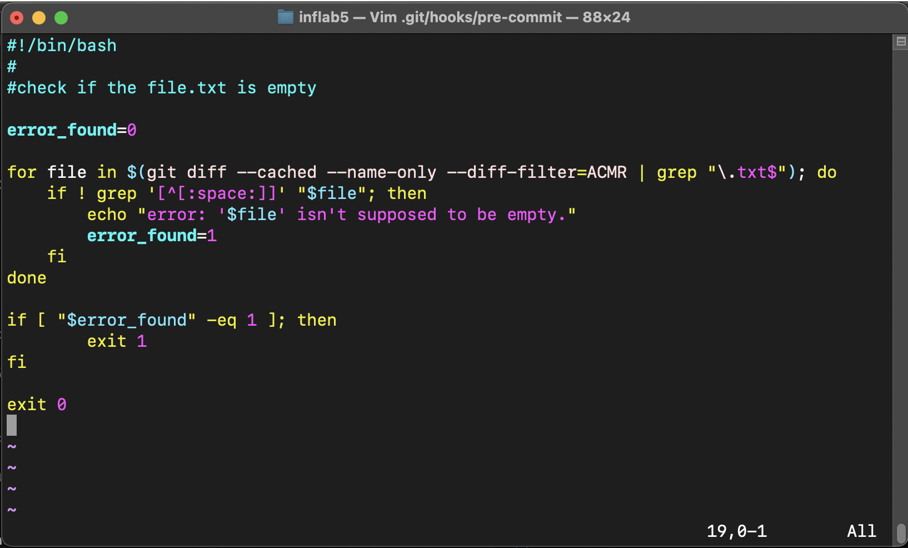

# Лабораторная работа №5

## Задание 1

1) Так как каждый репозиторий на `GitHub` создается сразу с папкой `.git`, в которой лежит папка `hooks`, необходимая нам, то создадим в ней файл `pre-commit`:

```
touch .git/hookers/pre-commit
```
Именно этот файл будет служить нам в качестве хука. Также для его исполняемости выдадим права всем пользователям:

```
chmod +x .git/hookers/pre-commit
```

2) Для того, чтобы при коммите обрабатывались файлы формата `.txt`, напишем следующую функцию:

```
for file in $(git diff --cached --name-only --diff-filter=ACMR | grep "\.txt$"); do
    if ! grep '[^[:space:]]' "$file"; then
        echo "error: '$file' is empty. you're not supposed to commit .txt files."
        exit 1
    fi
done

exit 0
```
Весь файл `pre-commit` выглядит следующим образомЖ

<p align="center">
 
</p>

