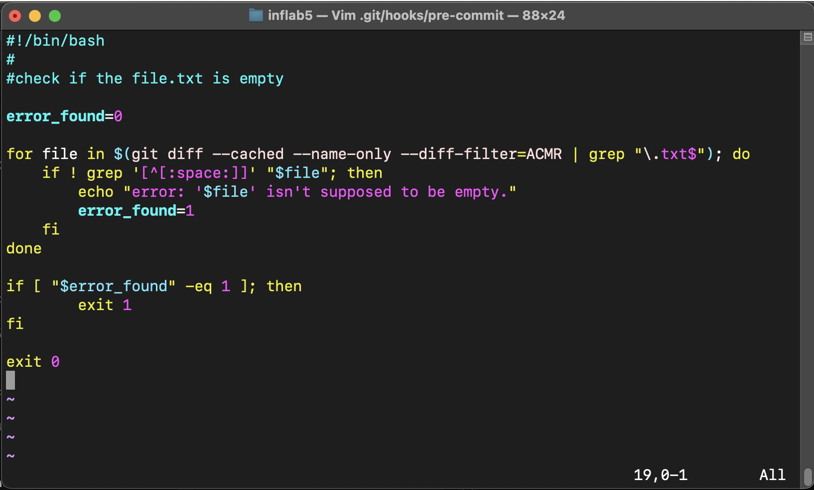
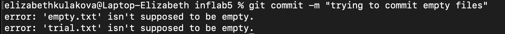
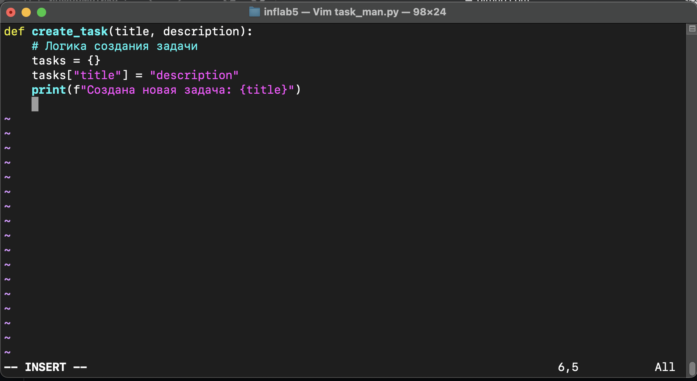
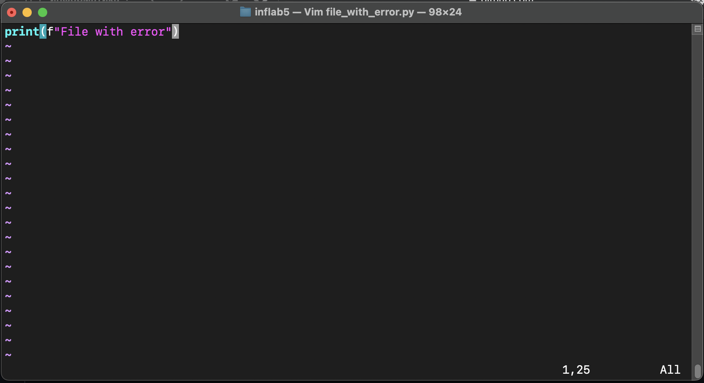

# Лабораторная работа №5

## Задание 1

1) Так как каждый репозиторий на `GitHub` создается сразу с папкой `.git`, в которой лежит папка `hooks`, необходимая нам, то создадим в ней файл `pre-commit`:

```
touch .git/hookers/pre-commit
```
Именно этот файл будет служить нам в качестве хука. Также для его исполняемости выдадим права всем пользователям:

```
chmod +x .git/hookers/pre-commit
```

2) Для того чтобы при коммите обрабатывались файлы формата `.txt`, напишем следующую функцию:

```
error_found=0

for file in $(git diff --cached --name-only --diff-filter=ACMR | grep "\.txt$"); do
    if ! grep '[^[:space:]]' "$file"; then
        echo "error: '$file' isn't supposed to be empty."
    	error_found=1    
    fi
done

if [ "$error_found" -eq 1 ]; then
	exit 1
fi

exit 0
```
Весь файл `pre-commit` выглядит следующим образом:

<p align="center">
 
</p>

3) Теперь для проверки работоспособности хука создадим два файла:
   - `empty.txt` пустой файл
   - `trial.txt` файл, заполненный пробелами, переносами строки и табуляциями

Попробуем закоммитить эти файлы:

```
git add empty.txt trial.txt
git commit -m "trying to commit empty files"
```

И увидим в терминале следующее:

<p align="center">
 
</p>

Результат говорит о том, что наш хук отработал верно.

4) Для того чтобы в дальнейшем не столкнуться с проблемами при новых коммитах, выполним команду `git reset --hard HEAD~`. Так, мы удалили ненужные файлы из локального репозитория и откатили изменения до предыдущего коммита.


## Задание 2

1. Установила Git Flow:

```
brew install git-flow
```

2. Выполнила инициализацию Git Flow:

```
git flow init -d
```

3. Создала ветку для новой функциональности `task-management`:

```
git flow feature start task-management
```

4. Создала и открыла файл `task_man.py`, записав туда код:

```
vim task_man.py
```

<p align="center">
 
</p>

Выполнила коммит изменения по мере разработки:

```
git add task_man.py
git commit -m "Добавлен функционал управления задачами"
```

5. После завершения разработки функции завершила фичу и объединила ее с основной веткой (второе действие выполнилось автоматически):

```
git flow feature finish task-management
```
Git Flow автоматически удалил ветку `feature/task-management` и переключился на ветку `develop`:

<p align="center">
 
</p>

6. Начала создание релиза

```
git flow release start v1.0.0
```

7. Внесла изменения, связанные с релизом:

```
echo "v1.0.0" > version.txt
git add version.txt
git commit -m "Обновлена версия для релиза v1.0.0"
```

8. Завершила релиз и объединила его с ветками "develop" и "main":

```
git flow release finish v1.0.0
```

<p align="center">
 
</p>

9. Создала hotfix:

```
git flow hotfix start hotfix-1.0.1
```

10. Внесла изменения в файл `file_with_error.py`:

<p align="center">
 
</p>

Зафиксировала изменения:

```
git add file_with_error.py
git commit -m "Исправлена критическая ошибка"
```

11. Завершила hotfix и объединила его с ветками "develop" и "main":

```
git flow hotfix finish hotfix-1.0.1
```

<p align="center">
 
</p>

12. Завершила работу и отправила изменения на удаленный репозиторий:

```
git push origin develop
git push origin main
```
